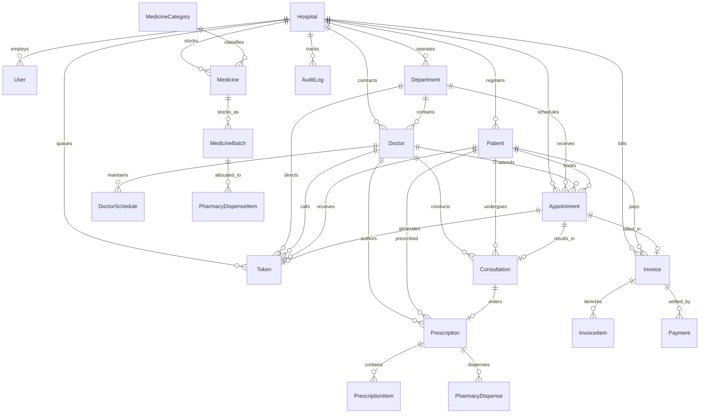

# Adyapan Hospital Queue & Appointment System — Database Documentation

## 1. Overview
The **Adyapan Hospital Queue & Appointment System** utilizes **PostgreSQL 18** managed through **Prisma ORM** (`provider = "postgresql"`). The database architecture enforces relational integrity via explicit foreign keys, cascade delete policies, unique business identifiers, high-throughput indexes, and transaction-level advisory locks (`pg_advisory_xact_lock`).

---

## 2. Entity Relationship Diagram (ERD)

---

## 3. Schema Models & Data Dictionary

### 1. `Hospital` (Tenant / Facility)
- **Primary Key:** `id` (UUID)
- **Fields:** `name` (String), `code` (String, Unique), `address` (String), `phone` (String), `email` (String), `isActive` (Boolean), `createdAt`, `updatedAt`.
- **Indexes:** `@@index([code])`

### 2. `User` (Staff Members & RBAC)
- **Primary Key:** `id` (UUID)
- **Foreign Keys:** `hospitalId` $\rightarrow$ `Hospital(id)`
- **Fields:** `email` (String, Unique), `password` (String, Bcrypt hash), `name` (String), `role` (Enum: `SUPER_ADMIN`, `HOSPITAL_ADMIN`, `RECEPTIONIST`, `DOCTOR`, `NURSE_ASSISTANT`, `PHARMACIST`, `ACCOUNTANT`), `status` (`ACTIVE`, `INACTIVE`), `phone` (String).
- **Indexes:** `@@index([hospitalId])`, `@@index([role])`

### 3. `Department` (Clinical Units)
- **Primary Key:** `id` (UUID)
- **Foreign Keys:** `hospitalId` $\rightarrow$ `Hospital(id)`
- **Fields:** `name` (String), `code` (String), `description` (String), `isActive` (Boolean).
- **Unique & Indexes:** `@@unique([hospitalId, code])`, `@@index([hospitalId])`

### 4. `Doctor` (Physician Profile)
- **Primary Key:** `id` (UUID)
- **Foreign Keys:** `hospitalId` $\rightarrow$ `Hospital(id)`, `userId` $\rightarrow$ `User(id)` (1-to-1), `departmentId` $\rightarrow$ `Department(id)`
- **Fields:** `specialization` (String), `consultationFee` (Float), `roomNumber` (String), `status` (`ACTIVE`, `ON_LEAVE`, `INACTIVE`).
- **Indexes:** `@@index([hospitalId])`, `@@index([departmentId])`

### 5. `DoctorSchedule` (Weekly Rosters)
- **Primary Key:** `id` (UUID)
- **Foreign Keys:** `doctorId` $\rightarrow$ `Doctor(id)`
- **Fields:** `dayOfWeek` (Int, 0=Sun..6=Sat), `startTime` (`"09:00"`), `endTime` (`"17:00"`), `slotDurationMinutes` (15), `maxCapacity` (30), `breakStartTime`, `breakEndTime`, `isActive` (Boolean).
- **Indexes:** `@@index([doctorId, dayOfWeek])`

### 6. `Patient` (Demographics & Medical Record)
- **Primary Key:** `id` (UUID)
- **Foreign Keys:** `hospitalId` $\rightarrow$ `Hospital(id)`
- **Fields:** `uhid` (String, Unique, format `ADY-YYYYMM-XXXX`), `fullName` (String), `phone` (String), `email` (String), `dateOfBirth` (DateTime), `gender` (`MALE`, `FEMALE`, `OTHER`), `bloodGroup` (String), `emergencyContact` (String), `medicalHistory` (String).
- **Indexes:** `@@index([hospitalId])`, `@@index([phone])`, `@@index([uhid])`

### 7. `Appointment` (Clinical Bookings)
- **Primary Key:** `id` (UUID)
- **Foreign Keys:** `hospitalId` $\rightarrow$ `Hospital(id)`, `patientId` $\rightarrow$ `Patient(id)`, `doctorId` $\rightarrow$ `Doctor(id)`, `departmentId` $\rightarrow$ `Department(id)`
- **Fields:** `appointmentDate` (DateTime), `timeSlot` (String e.g. `"10:30"`), `status` (`BOOKED`, `CHECKED_IN`, `IN_CONSULTATION`, `COMPLETED`, `CANCELLED`, `NO_SHOW`), `type` (`CONSULTATION`, `FOLLOW_UP`, `EMERGENCY`), `reason` (String).
- **Concurrency Guard:** Protected by PostgreSQL advisory locks on `hashtext(doctorId || date || timeSlot)`.
- **Indexes:** `@@index([hospitalId])`, `@@index([doctorId, appointmentDate])`, `@@index([patientId])`, `@@index([status])`

### 8. `Token` (Queue Token Engine)
- **Primary Key:** `id` (UUID)
- **Foreign Keys:** `hospitalId` $\rightarrow$ `Hospital(id)`, `patientId` $\rightarrow$ `Patient(id)`, `doctorId` $\rightarrow$ `Doctor(id)`, `departmentId` $\rightarrow$ `Department(id)`, `appointmentId` $\rightarrow$ `Appointment(id)`
- **Fields:** `tokenNumber` (Int), `queueDate` (DateTime), `tokenType` (`NORMAL`, `PRIORITY`, `EMERGENCY`), `status` (`WAITING`, `CALLED`, `IN_CONSULTATION`, `COMPLETED`, `SKIPPED`, `CANCELLED`), `calledAt`, `completedAt`.
- **Unique Constraint:** `@@unique([doctorId, queueDate, tokenNumber])`
- **Indexes:** `@@index([hospitalId])`, `@@index([doctorId, queueDate, status])`, `@@index([patientId])`

### 9. `Consultation` (Clinical Encounter)
- **Primary Key:** `id` (UUID)
- **Foreign Keys:** `hospitalId` $\rightarrow$ `Hospital(id)`, `patientId` $\rightarrow$ `Patient(id)`, `doctorId` $\rightarrow$ `Doctor(id)`, `appointmentId` $\rightarrow$ `Appointment(id)`, `tokenId` $\rightarrow$ `Token(id)`
- **Fields:** `diagnosis` (String, Mandatory), `symptoms` (String), `clinicalNotes` (String), `vitals` (JSON/String: BP, Pulse, Temp, SpO2, BMI), `status` (`IN_PROGRESS`, `COMPLETED`).
- **Indexes:** `@@index([hospitalId])`, `@@index([patientId])`, `@@index([doctorId])`

### 10. `Prescription` & `PrescriptionItem` (Digital Rx)
- **Primary Key:** `id` (UUID)
- **Foreign Keys:** `consultationId` $\rightarrow$ `Consultation(id)` (1-to-1), `patientId` $\rightarrow$ `Patient(id)`, `doctorId` $\rightarrow$ `Doctor(id)`
- **Fields:** `prescriptionCode` (String, Unique, format `RX-YYYYMM-XXXX`), `status` (`ACTIVE`, `PARTIALLY_DISPENSED`, `DISPENSED`), `notes` (String).
- **PrescriptionItem Fields:** `medicineId` $\rightarrow$ `Medicine(id)`, `dosage`, `frequency` (`"1-0-1"`), `duration`, `quantityPrescribed`, `quantityDispensed`.

### 11. `MedicineCategory`, `Medicine`, & `MedicineBatch` (Pharmacy Inventory)
- **Medicine Category:** Grouping (Analgesics, Antibiotics, etc.).
- **Medicine:** Name, generic name, unit (`TABLETS`, `CAPSULES`, `SYRUP`), `minStockAlert`.
- **MedicineBatch:**
  - Unique Constraint: `@@unique([medicineId, batchNumber])`
  - Fields: `batchNumber`, `expiryDate`, `quantity` (Current stock), `purchasePrice`, `sellingPrice`.
  - Indexes: `@@index([medicineId, expiryDate])` (Essential for FEFO query speed), `@@index([quantity])`.

### 12. `PharmacyDispense` & `PharmacyDispenseItem`
- **Fields:** `pharmacistId` $\rightarrow$ `User(id)`, `totalAmount` (Float), `status` (`COMPLETED`).
- **Item Fields:** `medicineBatchId` $\rightarrow$ `MedicineBatch(id)`, `quantity`, `unitPrice`, `totalPrice`.

### 13. `Invoice` & `InvoiceItem` (Billing Engine)
- **Primary Key:** `id` (UUID)
- **Foreign Keys:** `hospitalId` $\rightarrow$ `Hospital(id)`, `patientId` $\rightarrow$ `Patient(id)`, `appointmentId` $\rightarrow$ `Appointment(id)`
- **Fields:**
  - `invoiceNumber` (String, Unique, format `INV-YYYYMM-XXXX`)
  - `consultationFee` (Float), `pharmacyFee` (Float), `otherCharges` (Float), `discount` (Float), `tax` (Float)
  - `totalAmount` (Float), `paidAmount` (Float), `refundedAmount` (Float, Default 0.0)
  - `paymentStatus` (Enum: `PENDING`, `PARTIALLY_PAID`, `PAID`, `PARTIALLY_REFUNDED`, `REFUNDED`)
- **Indexes:** `@@index([hospitalId])`, `@@index([patientId])`, `@@index([paymentStatus])`

### 14. `Payment` (Multi-Transaction Ledger)
- **Primary Key:** `id` (UUID)
- **Foreign Keys:** `invoiceId` $\rightarrow$ `Invoice(id)`, `recordedById` $\rightarrow$ `User(id)`, `refundedById` $\rightarrow$ `User(id)`
- **Fields:**
  - `amount` (Float)
  - `paymentMethod` (`CASH`, `UPI`, `CARD`, `BANK_TRANSFER`)
  - `type` (`PAYMENT`, `REFUND`)
  - `status` (`SUCCESS`, `PENDING`, `FAILED`)
  - `transactionRef` (String)
  - `refundReason` (String, Mandatory on refunds)
  - `originalPaymentId` (String, Optional link to prior payment)
- **Indexes:** `@@index([hospitalId])`, `@@index([invoiceId])`, `@@index([type])`

### 15. `AuditLog` (Security Audit Trail)
- **Primary Key:** `id` (UUID)
- **Fields:** `hospitalId`, `userId`, `action` (`INVOICE_REFUND`, `DISPENSE_OVERRIDE`, `SLOT_OVERRIDE`), `entity` (`Invoice`, `Token`, `Batch`), `entityId`, `metadata` (JSON), `createdAt`.
- **Indexes:** `@@index([hospitalId])`, `@@index([entity, entityId])`

---

## 4. Concurrency Locking Architecture
PostgreSQL transaction-level advisory locks (`pg_advisory_xact_lock`) are used in high-contention business transactions:
1. **Appointment Booking:** `SELECT pg_advisory_xact_lock(hashtext(doctorId || '-' || dateStr || '-' || timeSlot))`
2. **Sequential Token Generation:** `SELECT pg_advisory_xact_lock(hashtext(doctorId || '-queue-' || dateKey))`
3. **Pharmacy Batch Dispensing:** `SELECT pg_advisory_xact_lock(hashtext('batch-' || batchId))`
4. **Refund Processing:** `SELECT pg_advisory_xact_lock(hashtext('invoice-' || invoiceId))`
