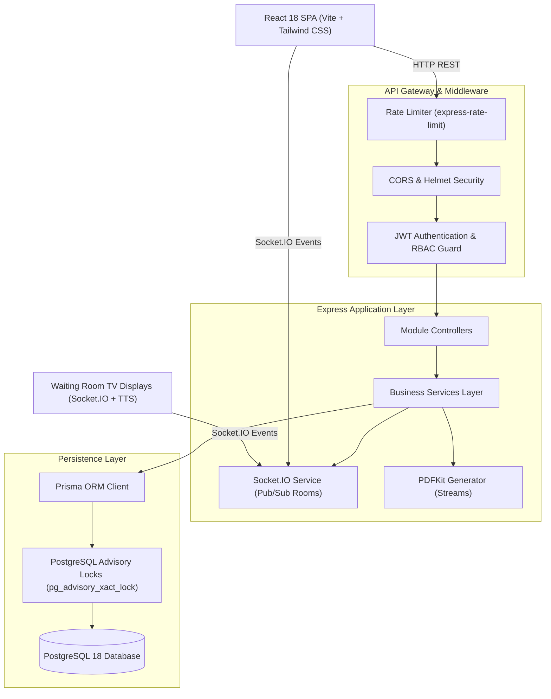

# Adyapan Hospital Queue & Appointment System — Project Documentation

## 1. Project Overview
The **Adyapan Hospital Queue & Appointment System** is an enterprise-grade, full-stack Hospital Management SaaS platform engineered specifically to solve high-density patient flows, scheduling bottlenecks, dispensing inaccuracies, and revenue leakages in multi-specialty clinical environments.

Developed on **Node.js, Express, React 18, Vite, PostgreSQL 18, and Prisma ORM**, the platform combines synchronous transactional clinical workflows with asynchronous real-time events powered by **Socket.IO** and voice synthesis via the **HTML5 Web Speech API**.

---

## 2. Problems Solved

1. **Unmanaged Waiting Areas & Overcrowding**:
   - Replaces physical queues with algorithmic triage tokens (`T-001`), sorting patients by urgency (`EMERGENCY` > `PRIORITY` > `NORMAL`).
   - Powers waiting room public display boards with automatic synthesized vocal announcements.

2. **Scheduling Collisions & Physician Double-Booking**:
   - Enforces PostgreSQL transaction-level advisory locks (`pg_advisory_xact_lock`) ensuring zero slot overlaps even under heavy concurrent online/counter booking.

3. **Handwritten Prescription Errors & Illegibility**:
   - Standardizes medication orders with structured frequencies (`1-0-1`), duration, dosages, and diagnostic ICD-coded notes.
   - Generates downloadable, cryptographically identifiable, printable PDFs via `pdfkit`.

4. **Medication Stock Leakage & Expiration Wastage**:
   - Implements strict **FEFO (First Expiring First Out)** batch allocation during pharmacy dispensing.
   - Real-time stock decrementing with atomic concurrency bounds (prevents negative inventory).

5. **Billing Inconsistencies & Unaudited Cash Handling**:
   - Generates consolidated encounter invoices capturing doctor consultation fees, pharmacy dispenses, and procedural charges.
   - Supports multi-mode payments (Cash, UPI, Card, Net Banking) and end-to-end partial/full refund workflows with immutable `AuditLog` records.

---

## 3. Major System Modules

```
┌────────────────────────────────────────────────────────────────────────┐
│               ADYAPAN HOSPITAL MANAGEMENT SUITE ARCHITECTURE            │
└────────────────────────────────────────────────────────────────────────┘
  │
  ├── 1. Patient Management Module
  │      • Automated Unique Health Identification (UHID) generator (ADY-YYYYMM-XXXX)
  │      • Longitudinal patient demographics, blood group, emergency contacts, medical history
  │
  ├── 2. Clinical Rostering & Scheduling Module
  │      • Department structuring and physician weekly shift assignments
  │      • Slot calculation engine (15-minute intervals, break time exclusions, capacity limits)
  │      • Concurrency collision defense preventing double-booking
  │
  ├── 3. Arrival Check-In & Token Dispatch
  │      • Walk-in and scheduled arrival token allocation
  │      • Sequential daily token numbering per doctor per day (T-001, T-002...)
  │      • Emergency triage priority routing
  │
  ├── 4. Live Queue Calling & Public Display Engine
  │      • Doctor calling desk with "Call Next", "Recall", and "Transfer" controls
  │      • Unauthenticated public TV display (/queue/tv) with privacy name masking (J*** D**)
  │      • Socket.IO instant room-based push events (<10ms latency)
  │      • HTML5 Web Speech automated voice announcements
  │
  ├── 5. Doctor Consultation Workstation
  │      • Patient past visit timeline & vital signs monitoring (BP, Pulse, Temp, SpO2, BMI)
  │      • Structured clinical encounter notes, symptoms, and diagnosis
  │
  ├── 6. Digital Prescriptions (Rx)
  │      • Automated prescription code generation (RX-YYYYMM-XXXX)
  │      • Structured dosage schedules (Morning-Noon-Night: 1-0-1)
  │      • On-demand binary PDF streaming with medical letterhead & doctor signature
  │
  ├── 7. Pharmacy Inventory & Dispensing
  │      • Central medicine catalog, category hierarchy, and multi-batch tracking
  │      • First Expiring First Out (FEFO) automated batch allocation
  │      • Atomic batch stock deduction and low-stock threshold alerting
  │
  ├── 8. Billing, Payments & Refund Ledger
  │      • Consolidated tax invoicing (INV-YYYYMM-XXXX) with GSTIN breakdown
  │      • Multi-mode payment recording (CASH, UPI, CARD, BANK_TRANSFER)
  │      • Partial & full refund processing with remaining balance validation
  │      • Downloadable Tax Invoice & Patient Receipt PDF with status watermarks
  │
  ├── 9. Role-Tailored Dashboards & Analytics
  │      • 6 distinct workstation views (Admin, Doctor, Receptionist, Nurse, Pharmacist, Accounts)
  │      • Financial revenue analytics, doctor workload reports, pharmacy movement, and CSV exports
  │
  └── 10. Security, Audit & Real-Time Foundation
         • Multi-tier rate limiting (Auth, TV Display, and General API)
         • JWT Bearer authentication, Bcrypt password hashing, and Helmet headers
         • Immutable security audit trail (AuditLog)
```

---

## 4. Complete System Workflow

```
[ Step 1: Patient Intake ]
  Patient arrives at Reception Desk -> Receptionist registers patient -> System generates UHID (e.g. ADY-202609-0001).

[ Step 2: Appointment / Walk-in Booking ]
  Receptionist or Patient selects Department and Doctor -> Selects active shift slot (e.g. 10:30) -> System locks slot with pg_advisory_xact_lock -> Appointment booked.

[ Step 3: Arrival Check-In & Token Dispatch ]
  Patient arrives at the clinic -> Receptionist checks in appointment -> System assigns sequential token (e.g. T-004) -> Real-time Socket.IO event emitted -> SMS dispatch sent.

[ Step 4: Live Queue Management ]
  Patient proceeds to waiting area -> Public TV Display updates dynamically -> Doctor presses "Call Next" -> Web Speech API announces "Token T-004, please proceed to Dr. Sharma in Room 102".

[ Step 5: Nurse Vitals Triage ]
  Nurse records Blood Pressure (120/80), Pulse (78 bpm), Temperature (98.6°F), SpO2 (99%) -> Vitals attached to patient visit.

[ Step 6: Physician Consultation ]
  Doctor reviews patient medical history -> Records clinical notes, symptoms, and diagnosis -> Completes consultation.

[ Step 7: Digital Prescription Authoring ]
  Doctor creates Rx with medications, frequencies (1-0-1), and durations -> Generates code RX-202609-0001 -> Available for instant PDF download or direct transfer to pharmacy.

[ Step 8: Pharmacy FEFO Dispensing ]
  Pharmacist opens active prescription -> System auto-allocates earliest expiring batches (FEFO) -> Pharmacist clicks Dispense -> Stock atomically deducted from batch.

[ Step 9: Consolidated Invoicing & Payment ]
  Cashier generates Tax Invoice -> System consolidates doctor fee (₹500) + pharmacy items (₹250) = ₹750 -> Patient pays via UPI -> Status transitions to PAID -> Cashier prints/downloads PDF receipt.

[ Step 10: Returns & Refunds (When Applicable) ]
  Patient returns unopened medication -> Accountant initiates refund via RefundModal -> System validates balance, issues ₹250 refund, updates status to PARTIALLY_REFUNDED, and logs audit record.
```

---

## 5. User Roles & Access Control

| Role | Primary Functions | Authorized Access Routes |
|------|-------------------|--------------------------|
| `SUPER_ADMIN` | Global platform administration, hospital registration, system configuration | All routes across all modules |
| `HOSPITAL_ADMIN` | Department management, staff user management, financial reports, hospital KPIs | `/api/users`, `/api/departments`, `/api/reports`, `/api/dashboard/admin` |
| `RECEPTIONIST` | Patient registration, appointment booking, arrival check-in, token issuing | `/api/patients`, `/api/appointments`, `/api/tokens`, `/api/dashboard/receptionist` |
| `DOCTOR` | Calling queue, consultation workstation, diagnosis, digital prescriptions | `/api/queue/doctor/*`, `/api/consultations`, `/api/prescriptions`, `/api/dashboard/doctor` |
| `NURSE_ASSISTANT` | Vital signs triage intake, queue monitoring, assistance | `/api/tokens`, `/api/queue/*`, `/api/consultations/vitals`, `/api/dashboard/nurse` |
| `PHARMACIST` | Medicine catalog, batch management, FEFO dispensing, stock alerts | `/api/pharmacy/*`, `/api/dashboard/pharmacist` |
| `ACCOUNTANT` | Invoice generation, payment collection, partial/full refunds, billing reports | `/api/billing/*`, `/api/reports/financial`, `/api/dashboard/accountant` |

---

## 6. Architecture & Data Flow



---

## 7. Security Overview

1. **Authentication & Token Storage**:
   - Industry-standard HMAC SHA-256 JWT tokens.
   - Passwords salted and hashed with **Bcrypt** (salt factor 10).
2. **Denial-of-Service Defense**:
   - `authLimiter`: Strict 30 login requests per 15-minute window per IP.
   - `publicLimiter`: 180 requests per minute on unauthenticated display feeds.
   - `generalApiLimiter`: 1000 requests per 15-minute window across all API routes.
3. **Data Protection & Privacy**:
   - Public displays automatically mask patient names (`J*** D**`).
   - Patient Medical Records accessible strictly by authorized clinical personnel.
4. **Audit Logging**:
   - Every refund, fee waiver, and critical data change creates an immutable `AuditLog` row recording user ID, timestamp, entity ID, and previous/new values.
